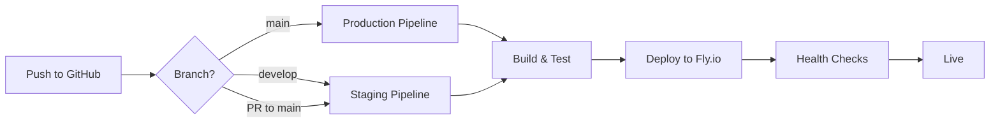

# Golf X Deployment Guide

## Overview
Golf X is deployed using GitHub Actions CI/CD pipeline to Fly.io hosting platform.

## Prerequisites

### 1. Fly.io Setup
1. **Create Fly.io account**: https://fly.io
2. **Install Fly CLI**:
   ```bash
   # Windows (PowerShell)
   powershell -Command "iwr https://fly.io/install.ps1 -useb | iex"
   
   # Mac/Linux
   curl -L https://fly.io/install.sh | sh
   ```

3. **Login to Fly.io**:
   ```bash
   flyctl auth login
   ```

4. **Create the apps**:
   ```bash
   # Production app
   flyctl apps create golf-x
   
   # Staging app (optional)
   flyctl apps create golf-x-staging
   ```

5. **Get your API token**:
   ```bash
   flyctl auth token
   ```
   Save this token - you'll need it for GitHub secrets.

### 2. GitHub Repository Setup

1. **Add Secrets to GitHub**:
   - Go to your repository → Settings → Secrets and variables → Actions
   - Add the following secrets:
     - `FLY_API_TOKEN`: Your Fly.io API token from step 5 above
     - `VITE_SUPABASE_URL`: Your Supabase project URL
     - `VITE_SUPABASE_ANON_KEY`: Your Supabase anonymous key

2. **Repository Structure**:
   ```
   golf-x/
   ├── .github/
   │   └── workflows/
   │       ├── deploy.yml      # Production deployment (main branch)
   │       └── staging.yml     # Staging deployment (develop branch)
   ├── Dockerfile             # Container configuration
   ├── fly.toml              # Fly.io configuration
   └── ...
   ```

## Deployment Process

### Automatic Deployments

1. **Production** (https://golf-x.fly.dev):
   - Triggers on push to `main` branch
   - Runs tests, build, and deploys to production

2. **Staging** (https://golf-x-staging.fly.dev):
   - Triggers on push to `develop` branch
   - Triggers on pull requests to `main`
   - Adds comment to PR with staging URL

### Manual Deployment

If you need to deploy manually:

```bash
# Deploy to production
flyctl deploy

# Deploy to staging
flyctl deploy --app golf-x-staging

# Check deployment status
flyctl status

# View logs
flyctl logs

# SSH into container
flyctl ssh console
```

## Environment Variables

### Required for Build
- `VITE_SUPABASE_URL`: Supabase project URL
- `VITE_SUPABASE_ANON_KEY`: Supabase anonymous key

### Set in Fly.io (if needed)
```bash
flyctl secrets set KEY=value
```

## Monitoring

### Check Application Status
```bash
# View app status
flyctl status --app golf-x

# View recent logs
flyctl logs --app golf-x

# Monitor in real-time
flyctl logs --app golf-x --tail
```

### Fly.io Dashboard
- Production: https://fly.io/apps/golf-x
- Staging: https://fly.io/apps/golf-x-staging

## Rollback

If you need to rollback to a previous version:

```bash
# List releases
flyctl releases --app golf-x

# Rollback to specific version
flyctl deploy --app golf-x --image registry.fly.io/golf-x:v{version_number}
```

## Troubleshooting

### Build Failures
1. Check GitHub Actions logs
2. Verify environment variables are set
3. Test build locally: `npm run build`

### Deployment Failures
1. Check Fly.io logs: `flyctl logs --app golf-x`
2. Verify fly.toml configuration
3. Check Dockerfile for issues

### Health Check Failures
- The app serves static files on port 8080
- Health check endpoint: `/`
- Ensure the build completes successfully

## Local Testing

Test the Docker build locally:

```bash
# Build Docker image
docker build -t golf-x .

# Run locally
docker run -p 8080:8080 golf-x

# Visit http://localhost:8080
```

## CI/CD Workflow



## Support

- Fly.io Documentation: https://fly.io/docs
- Fly.io Status: https://status.fly.io
- GitHub Actions: https://docs.github.com/en/actions