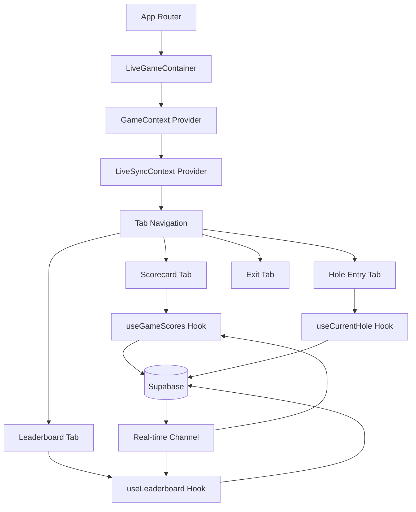

# Normal Game Feature - Architecture Review

## Executive Summary

This document provides comprehensive architectural recommendations for implementing the Normal Game feature in the Golf X application. The architecture focuses on scalability, real-time synchronization, and optimal performance while maintaining code maintainability.

## 1. Recommended Folder Structure

```
src/
├── features/
│   └── normal-game/
│       ├── components/
│       │   ├── game-creation/
│       │   │   ├── GameSetup.tsx
│       │   │   ├── CourseSelection.tsx
│       │   │   ├── ParticipantSelector.tsx
│       │   │   └── PlayerConfiguration.tsx
│       │   ├── live-game/
│       │   │   ├── LiveGameContainer.tsx
│       │   │   ├── Scorecard.tsx
│       │   │   ├── Leaderboard.tsx
│       │   │   ├── HoleEntry.tsx
│       │   │   └── GameNotes.tsx
│       │   ├── common/
│       │   │   ├── ScoreInput.tsx
│       │   │   ├── HandicapInput.tsx
│       │   │   ├── TeeSelector.tsx
│       │   │   └── LiveMatchCard.tsx
│       │   └── index.ts
│       ├── hooks/
│       │   ├── useGame.ts
│       │   ├── useGameScores.ts
│       │   ├── useGameParticipants.ts
│       │   ├── useHandicapCalculations.ts
│       │   ├── useGameStatistics.ts
│       │   └── useRealtimeSync.ts
│       ├── services/
│       │   ├── gameService.ts
│       │   ├── scoreService.ts
│       │   ├── handicapService.ts
│       │   ├── statisticsService.ts
│       │   └── realtimeService.ts
│       ├── types/
│       │   ├── game.types.ts
│       │   ├── score.types.ts
│       │   └── database.types.ts
│       ├── utils/
│       │   ├── handicapCalculations.ts
│       │   ├── scoreValidation.ts
│       │   ├── gameStateManager.ts
│       │   └── conflictResolution.ts
│       └── contexts/
│           ├── GameContext.tsx
│           └── LiveSyncContext.tsx
```

## 2. State Management Architecture

### Hybrid Approach: Context API + Custom Hooks + Local State

```typescript
// GameContext.tsx - Global game state
interface GameContextValue {
  currentGame: Game | null;
  participants: GameParticipant[];
  isCreator: boolean;
  gameStatus: GameStatus;
  actions: {
    createGame: (config: GameConfig) => Promise<void>;
    updateGameStatus: (status: GameStatus) => Promise<void>;
    closeGame: () => Promise<void>;
  };
}

// LiveSyncContext.tsx - Real-time synchronization
interface LiveSyncContextValue {
  syncStatus: 'synced' | 'syncing' | 'offline' | 'error';
  lastSyncAt: Date | null;
  pendingUpdates: number;
  autoRefreshEnabled: boolean;
  actions: {
    toggleAutoRefresh: () => void;
    manualRefresh: () => Promise<void>;
    syncScores: (scores: ScoreUpdate[]) => Promise<void>;
  };
}

// Custom hooks for specific domains
const useGameScores = (gameId: string) => {
  const [scores, setScores] = useState<HoleScore[]>([]);
  const [loading, setLoading] = useState(true);
  const { syncStatus } = useLiveSync();
  
  // Subscribe to real-time updates
  // Handle optimistic updates
  // Queue offline changes
  
  return { scores, loading, updateScore, syncStatus };
};

// Component-level local state for UI
const HoleEntry = () => {
  const [localScores, setLocalScores] = useState({});
  const [isDirty, setIsDirty] = useState(false);
  const { updateScore } = useGameScores();
  
  // Debounced save logic
  // Validation before sync
};
```

### State Management Decision Matrix

| State Type | Storage | Rationale |
|------------|---------|-----------|
| Game metadata | GameContext | Shared across all game screens |
| Live scores | Custom hooks + Supabase | Real-time sync requirements |
| UI state (tabs, modals) | Local component state | Component-specific, no persistence |
| User preferences | LocalStorage | Persist across sessions |
| Offline queue | IndexedDB | Reliability for offline mode |

## 3. Real-time Data Synchronization Strategy

### Three-tier Sync Architecture

```typescript
// Tier 1: Immediate Push (Player's own actions)
const updateScore = async (holeNumber: number, strokes: number) => {
  // 1. Optimistic update
  setLocalScores(prev => ({ ...prev, [holeNumber]: strokes }));
  
  // 2. Queue for sync
  await queueManager.add({
    type: 'SCORE_UPDATE',
    payload: { holeNumber, strokes },
    timestamp: Date.now()
  });
  
  // 3. Attempt immediate sync
  if (isOnline) {
    await syncImmediately();
  }
};

// Tier 2: Auto-refresh Pull (30-second intervals)
useInterval(() => {
  if (autoRefreshEnabled && !document.hidden) {
    pullLatestScores();
  }
}, 30000);

// Tier 3: Real-time Subscriptions (Supabase Realtime)
useEffect(() => {
  const channel = supabase.channel(`game:${gameId}`)
    .on('postgres_changes', {
      event: '*',
      schema: 'public',
      table: 'game_hole_scores',
      filter: `game_id=eq.${gameId}`
    }, handleScoreChange)
    .subscribe();
    
  return () => { channel.unsubscribe(); };
}, [gameId]);
```

### Conflict Resolution Strategy

```typescript
class ConflictResolver {
  resolve(local: ScoreUpdate, remote: ScoreUpdate): ScoreUpdate {
    // Last Write Wins with timestamp comparison
    if (remote.updated_at > local.updated_at) {
      return remote;
    }
    
    // If timestamps equal, prefer lower score (conservative)
    if (remote.updated_at === local.updated_at) {
      return remote.strokes < local.strokes ? remote : local;
    }
    
    return local;
  }
}
```

## 4. Component Hierarchy and Data Flow



### Data Flow Patterns

1. **Unidirectional Flow**: Actions → Services → Supabase → Subscriptions → State → UI
2. **Optimistic Updates**: UI → Local State → Background Sync → Confirmation/Rollback
3. **Error Boundaries**: Each major component wrapped for graceful degradation

## 5. Supabase Integration Patterns

### Service Layer Architecture

```typescript
// gameService.ts
export class GameService {
  private static instance: GameService;
  private retryQueue: RetryQueue;
  
  async createGame(config: GameConfig): Promise<Game> {
    const { data, error } = await supabase
      .from('games')
      .insert(config)
      .select()
      .single();
      
    if (error) {
      throw new GameCreationError(error);
    }
    
    return this.transformGame(data);
  }
  
  subscribeToGame(gameId: string, callback: (game: Game) => void) {
    return supabase
      .channel(`game-${gameId}`)
      .on('postgres_changes', {
        event: '*',
        schema: 'public',
        table: 'games',
        filter: `id=eq.${gameId}`
      }, callback)
      .subscribe();
  }
}

// Type-safe hooks
export function useGameService() {
  const service = useMemo(() => GameService.getInstance(), []);
  return service;
}
```

### Database Types Generation

```typescript
// database.types.ts (auto-generated from Supabase)
export interface Database {
  public: {
    Tables: {
      games: {
        Row: {
          id: string;
          course_id: number;
          creator_user_id: string;
          game_description: string | null;
          scoring_format: 'match_play' | 'stroke_play';
          weather_condition: WeatherCondition | null;
          status: GameStatus;
          created_at: string;
          started_at: string | null;
          completed_at: string | null;
        };
        Insert: Omit<Row, 'id' | 'created_at'>;
        Update: Partial<Insert>;
      };
      // ... other tables
    };
  };
}
```

## 6. Performance Optimization Strategies

### 30-Second Auto-refresh Optimization

```typescript
// Intelligent refresh strategy
class SmartRefreshManager {
  private lastActivity: number = Date.now();
  private visibilityState: 'visible' | 'hidden' = 'visible';
  private refreshTimer: NodeJS.Timer | null = null;
  
  startAutoRefresh(callback: () => Promise<void>) {
    this.refreshTimer = setInterval(async () => {
      // Skip if page hidden or user inactive
      if (this.visibilityState === 'hidden') return;
      if (Date.now() - this.lastActivity > 120000) return; // 2 min inactivity
      
      // Batch multiple requests
      await Promise.all([
        this.refreshScores(),
        this.refreshLeaderboard(),
        this.refreshStatistics()
      ]);
    }, 30000);
  }
  
  // Adaptive refresh rate based on game activity
  adjustRefreshRate(activity: 'high' | 'medium' | 'low') {
    const rates = { high: 15000, medium: 30000, low: 60000 };
    this.updateRefreshInterval(rates[activity]);
  }
}
```

### Query Optimization

```sql
-- Optimized scorecard query with single round-trip
CREATE OR REPLACE FUNCTION get_game_scorecard(p_game_id UUID)
RETURNS JSON AS $$
BEGIN
  RETURN json_build_object(
    'game', (SELECT row_to_json(g) FROM games g WHERE g.id = p_game_id),
    'participants', (
      SELECT json_agg(row_to_json(p))
      FROM game_participants p
      WHERE p.game_id = p_game_id
    ),
    'scores', (
      SELECT json_agg(row_to_json(s))
      FROM game_hole_scores s
      WHERE s.game_id = p_game_id
      ORDER BY s.user_id, s.hole_number
    )
  );
END;
$$ LANGUAGE plpgsql;
```

### Memory Management

```typescript
// Cleanup subscriptions and prevent memory leaks
const useRealtimeGame = (gameId: string) => {
  useEffect(() => {
    const subscriptions: RealtimeChannel[] = [];
    
    // Subscribe to multiple tables
    subscriptions.push(
      supabase.channel(`game-${gameId}`).subscribe(),
      supabase.channel(`scores-${gameId}`).subscribe()
    );
    
    return () => {
      // Cleanup all subscriptions
      subscriptions.forEach(sub => sub.unsubscribe());
    };
  }, [gameId]);
};
```

## 7. Error Handling and Offline Support

### Error Handling Architecture

```typescript
// Custom error classes
class GameError extends Error {
  constructor(
    message: string,
    public code: string,
    public recoverable: boolean = true
  ) {
    super(message);
  }
}

// Global error boundary
class GameErrorBoundary extends Component {
  componentDidCatch(error: Error, errorInfo: ErrorInfo) {
    if (error instanceof GameError && error.recoverable) {
      this.attemptRecovery(error);
    } else {
      this.logToSentry(error, errorInfo);
    }
  }
  
  attemptRecovery(error: GameError) {
    switch (error.code) {
      case 'NETWORK_ERROR':
        this.enableOfflineMode();
        break;
      case 'SYNC_CONFLICT':
        this.showConflictResolution();
        break;
    }
  }
}
```

### Offline Support Strategy

```typescript
// Offline queue manager
class OfflineQueueManager {
  private queue: PendingUpdate[] = [];
  private db: IDBDatabase;
  
  async queueUpdate(update: PendingUpdate) {
    // Store in IndexedDB
    await this.persistToIndexedDB(update);
    
    // Add to memory queue
    this.queue.push(update);
    
    // Attempt sync if online
    if (navigator.onLine) {
      this.processQueue();
    }
  }
  
  async processQueue() {
    while (this.queue.length > 0) {
      const batch = this.queue.splice(0, 10); // Process in batches
      
      try {
        await this.syncBatch(batch);
        await this.removeFromIndexedDB(batch.map(u => u.id));
      } catch (error) {
        // Return items to queue on failure
        this.queue.unshift(...batch);
        throw error;
      }
    }
  }
}
```

## 8. Handicap Calculation Best Practices

### Centralized Handicap Service

```typescript
// handicapService.ts
export class HandicapService {
  calculateCourseHandicap(
    handicapIndex: number,
    slope: number,
    rating: number,
    par: number
  ): number {
    return Math.round(
      handicapIndex * (slope / 113) + (rating - par)
    );
  }
  
  calculateMatchHandicap(
    participants: GameParticipant[]
  ): Map<string, number> {
    const playingHandicaps = participants.map(p => ({
      userId: p.user_id,
      ph: p.playing_handicap
    }));
    
    const minHandicap = Math.min(...playingHandicaps.map(p => p.ph));
    
    return new Map(
      playingHandicaps.map(p => [
        p.userId,
        p.ph - minHandicap
      ])
    );
  }
  
  distributeStrokes(
    matchHandicap: number,
    holes: Hole[]
  ): Map<number, number> {
    const strokeAllocation = new Map<number, number>();
    
    // Sort holes by handicap index
    const sortedHoles = [...holes].sort((a, b) => 
      a.handicap_index - b.handicap_index
    );
    
    // Allocate strokes
    for (let i = 0; i < matchHandicap; i++) {
      const hole = sortedHoles[i % 18];
      const current = strokeAllocation.get(hole.number) || 0;
      strokeAllocation.set(hole.number, current + 1);
    }
    
    return strokeAllocation;
  }
}
```

### Validation and Constraints

```typescript
// Score validation with handicap consideration
const validateScore = (
  strokes: number,
  par: number,
  handicapStrokes: number
): ValidationResult => {
  const maxScore = Math.max(25, par * 3); // ESC limit
  
  if (strokes < 1) {
    return { valid: false, error: 'Score must be at least 1' };
  }
  
  if (strokes > maxScore) {
    return { valid: false, error: `Maximum score is ${maxScore}` };
  }
  
  // Warning for unusual scores
  if (strokes > par + 5 + handicapStrokes) {
    return { 
      valid: true, 
      warning: 'Unusually high score. Please confirm.' 
    };
  }
  
  return { valid: true };
};
```

## 9. API Endpoint Design

### RESTful API Structure (Supabase Functions)

```typescript
// Edge Functions for complex operations

// POST /functions/v1/create-game
interface CreateGameRequest {
  courseId: number;
  description?: string;
  weatherCondition?: WeatherCondition;
  participants: Array<{
    userId: string;
    teeBoxId: number;
    handicapIndex: number;
  }>;
}

// POST /functions/v1/update-scores
interface UpdateScoresRequest {
  gameId: string;
  scores: Array<{
    userId: string;
    holeNumber: number;
    strokes: number;
    putts?: number;
  }>;
}

// GET /functions/v1/game-statistics/{gameId}
interface GameStatisticsResponse {
  game: Game;
  leaderboard: LeaderboardEntry[];
  scoreDistribution: ScoreDistribution;
  predictions: MatchPredictions;
}
```

### GraphQL Alternative (if needed)

```graphql
type Mutation {
  createGame(input: CreateGameInput!): GamePayload!
  updateScore(gameId: ID!, holeNumber: Int!, score: ScoreInput!): ScorePayload!
  closeGame(gameId: ID!): GamePayload!
}

type Subscription {
  gameUpdated(gameId: ID!): Game!
  scoresUpdated(gameId: ID!): [Score!]!
  leaderboardChanged(gameId: ID!): Leaderboard!
}
```

## 10. Technology Recommendations

### Core Stack Confirmation

| Technology | Purpose | Rationale |
|------------|---------|-----------|
| React 19 | UI Framework | Already in use, excellent concurrent features |
| TypeScript | Type Safety | Prevents runtime errors, improves DX |
| Ionic 8 | Mobile UI | iOS-style components, PWA support |
| Supabase | Backend | Real-time, auth, RLS built-in |
| React Router v5 | Navigation | Required by Ionic, stable |

### Additional Recommendations

| Technology | Purpose | Rationale |
|------------|---------|-----------|
| React Query/TanStack Query | Server State | Caching, background refetch, optimistic updates |
| Zod | Runtime Validation | Type-safe validation for API responses |
| date-fns | Date Manipulation | Lightweight, tree-shakeable |
| Workbox | PWA/Offline | Already included, enhance offline support |
| React Hook Form | Form Management | Performance, validation integration |

### Monitoring & Analytics

```typescript
// Performance monitoring
import { Metric } from 'web-vitals';

export function reportWebVitals(metric: Metric) {
  // Send to analytics
  if (metric.name === 'FCP' && metric.value > 2000) {
    console.warn('Slow First Contentful Paint:', metric.value);
  }
}

// Custom game metrics
class GameMetrics {
  trackEvent(event: 'game_created' | 'score_updated' | 'game_completed', data: any) {
    // Send to analytics service
  }
  
  trackTiming(category: string, variable: string, time: number) {
    // Track performance metrics
  }
}
```

## 11. Security Considerations

### Row-Level Security (RLS) Enforcement

```sql
-- Ensure players can only modify active games they're in
CREATE POLICY "Players update own active games" ON game_hole_scores
FOR UPDATE USING (
  EXISTS (
    SELECT 1 FROM game_participants gp
    JOIN games g ON g.id = gp.game_id
    WHERE gp.game_id = game_hole_scores.game_id
      AND gp.user_id = auth.uid()
      AND g.status = 'active'
  )
);
```

### Input Sanitization

```typescript
// Sanitize user input
const sanitizeGameDescription = (input: string): string => {
  return input
    .trim()
    .substring(0, 100)
    .replace(/[<>]/g, ''); // Basic XSS prevention
};

// Validate all numeric inputs
const validateNumericInput = (
  value: any,
  min: number,
  max: number
): number => {
  const num = Number(value);
  if (isNaN(num)) throw new ValidationError('Invalid number');
  if (num < min || num > max) {
    throw new ValidationError(`Value must be between ${min} and ${max}`);
  }
  return num;
};
```

## 12. Testing Strategy

### Unit Testing

```typescript
// handicapCalculations.test.ts
describe('HandicapService', () => {
  it('calculates course handicap correctly', () => {
    const ch = handicapService.calculateCourseHandicap(
      12.5, // HI
      132,  // Slope
      71.5, // Rating
      72    // Par
    );
    expect(ch).toBe(14);
  });
  
  it('distributes strokes correctly', () => {
    const strokes = handicapService.distributeStrokes(7, holes);
    expect(strokes.get(1)).toBe(1); // Hole with HCP 1 gets stroke
    expect(strokes.get(18)).toBe(0); // Hole with HCP 18 gets no stroke
  });
});
```

### Integration Testing

```typescript
// gameFlow.integration.test.ts
describe('Game Flow Integration', () => {
  it('creates game with participants', async () => {
    const game = await gameService.createGame(mockConfig);
    expect(game.participants).toHaveLength(2);
    expect(game.status).toBe('setup');
  });
  
  it('syncs scores in real-time', async () => {
    const updates = await scoreService.updateScores(mockScores);
    // Wait for real-time sync
    await waitFor(() => {
      expect(mockSubscriber).toHaveBeenCalledWith(updates);
    });
  });
});
```

## 13. Deployment Considerations

### Environment Variables

```typescript
// config/environment.ts
export const config = {
  supabase: {
    url: process.env.VITE_SUPABASE_URL!,
    anonKey: process.env.VITE_SUPABASE_ANON_KEY!,
  },
  features: {
    autoRefreshInterval: Number(process.env.VITE_AUTO_REFRESH_INTERVAL || 30000),
    maxParticipants: Number(process.env.VITE_MAX_PARTICIPANTS || 6),
    offlineQueueSize: Number(process.env.VITE_OFFLINE_QUEUE_SIZE || 100),
  },
  monitoring: {
    sentryDsn: process.env.VITE_SENTRY_DSN,
    enableAnalytics: process.env.VITE_ENABLE_ANALYTICS === 'true',
  }
};
```

### Progressive Web App Configuration

```json
// vite.config.ts - PWA plugin configuration
{
  registerType: 'autoUpdate',
  workbox: {
    runtimeCaching: [
      {
        urlPattern: /^https:\/\/.*\.supabase\.co\/rest\/v1\/.*/i,
        handler: 'NetworkFirst',
        options: {
          cacheName: 'supabase-api-cache',
          expiration: {
            maxEntries: 50,
            maxAgeSeconds: 300 // 5 minutes
          }
        }
      }
    ]
  }
}
```

## 14. Migration Path

### Phase 1: Core Implementation (Week 1-2)
1. Set up folder structure and types
2. Implement GameContext and basic services
3. Create game creation flow
4. Basic scorecard display

### Phase 2: Real-time Features (Week 3)
1. Implement Supabase subscriptions
2. Add auto-refresh mechanism
3. Offline queue management
4. Conflict resolution

### Phase 3: UI Polish (Week 4)
1. Animations and transitions
2. Error states and loading states
3. Performance optimization
4. Testing and bug fixes

## 15. Performance Metrics & SLAs

### Target Metrics

| Metric | Target | Critical |
|--------|--------|----------|
| Initial Load Time | < 2s | < 4s |
| Score Update Latency | < 500ms | < 2s |
| Auto-refresh Cycle | 30s ± 2s | 30s ± 5s |
| Offline Queue Sync | < 5s after online | < 30s |
| Memory Usage | < 50MB | < 100MB |
| Battery Drain (mobile) | < 5%/hour | < 10%/hour |

### Monitoring Dashboard

```typescript
// Real-time monitoring
interface PerformanceMonitor {
  trackMetric(name: string, value: number): void;
  trackError(error: Error, context: any): void;
  trackUserAction(action: string, metadata: any): void;
}

// Implementation
const monitor: PerformanceMonitor = {
  trackMetric: (name, value) => {
    // Send to monitoring service
    if (value > THRESHOLDS[name]) {
      console.warn(`Performance degradation: ${name} = ${value}`);
    }
  },
  // ...
};
```

## Conclusion

This architecture provides a solid foundation for implementing the Normal Game feature with:

1. **Clear separation of concerns** through the folder structure
2. **Optimal state management** balancing global and local state
3. **Robust real-time sync** with conflict resolution
4. **Performance optimization** for 30-second refresh cycles
5. **Comprehensive error handling** and offline support
6. **Type safety** throughout the application
7. **Scalability** to handle concurrent games and users

The recommended approach prioritizes user experience with optimistic updates, graceful degradation, and intelligent sync strategies while maintaining code quality and maintainability.

## Next Steps

1. Review and approve architecture
2. Set up development environment
3. Begin Phase 1 implementation
4. Create detailed component specifications
5. Establish testing infrastructure

## References

- [Supabase Real-time Documentation](https://supabase.com/docs/guides/realtime)
- [React 19 Concurrent Features](https://react.dev/blog/2024/04/25/react-19)
- [Ionic React Best Practices](https://ionicframework.com/docs/react)
- [TypeScript Handbook](https://www.typescriptlang.org/docs/)