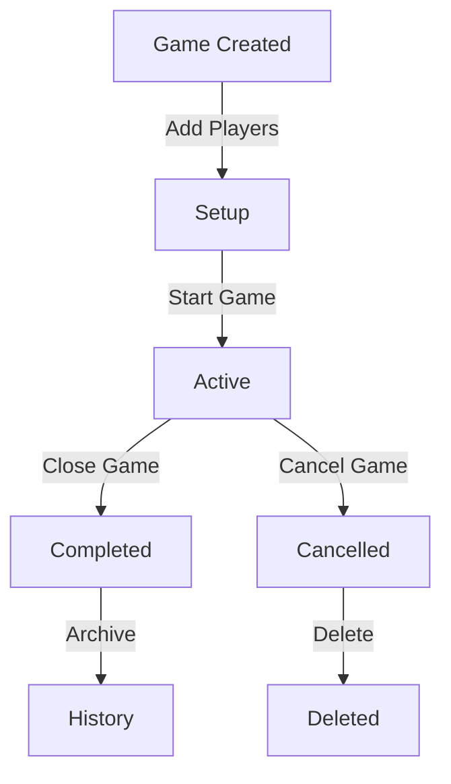

# Normal Game Feature Specification

## Overview
The Normal Game mode allows players to create casual golf matches with friends, track scores in real-time, and maintain game history. Only friend-based matches are supported with 2-6 players maximum.

## User Flow

### 1. Game Creation Flow

#### 1.1 Initial Setup Screen
When user taps "Normal Game" from home:

```
┌─────────────────────────┐
│     Create New Game     │
├─────────────────────────┤
│                         │
│ Game Description:       │
│ [Loser pays dinner! 🍽️] │
│ (optional, 100 chars)   │
│                         │
│ Select Golf Course:     │
│ [La Moraleja       ▼]   │
│                         │
│ Weather Conditions:     │
│ ┌────┬────┬────┬────┐  │
│ │ ☀️ │ ⛅ │ 🌧️ │ 💨 │  │
│ │Sun │Part│Rain│Wind│  │
│ └────┴────┴────┴────┘  │
│     [✓ Sunny]           │
│                         │
│ Scoring Format:         │
│ ◉ Match Play           │
│ ○ Stroke Play (Soon)   │
│                         │
│ [Add Participants →]    │
└─────────────────────────┘
```

#### 1.2 Add Participants Screen
```
┌─────────────────────────┐
│    Add Participants     │
│    (Min 2, Max 6)       │
├─────────────────────────┤
│ Your Friends:           │
│                         │
│ □ John Smith           │
│ □ Mike Johnson         │
│ □ Sarah Williams       │
│ □ Tom Brown            │
│                         │
│ Selected: 0/6           │
│                         │
│ [Cancel]    [Next →]    │
└─────────────────────────┘
```

#### 1.3 Player Configuration Screen
For each selected participant:

```
┌─────────────────────────┐
│   Player Configuration  │
├─────────────────────────┤
│ John Smith              │
│                         │
│ Handicap Index:         │
│ [-] 12.5 [+]           │
│                         │
│ Select Tee:             │
│ ○ Black (Champion)      │
│ ◉ Blue (Men's)         │
│ ○ White (Senior)        │
│ ○ Red (Ladies')         │
│                         │
│ Course Handicap: 14     │
│ Match Handicap: 0       │
├─────────────────────────┤
│ Mike Johnson            │
│                         │
│ Handicap Index:         │
│ [-] 18.0 [+]           │
│                         │
│ Select Tee:             │
│ ○ Black (Champion)      │
│ ○ Blue (Men's)         │
│ ◉ White (Senior)        │
│ ○ Red (Ladies')         │
│                         │
│ Course Handicap: 21     │
│ Match Handicap: 7       │
├─────────────────────────┤
│                         │
│ [Back]    [Review & Start] │
└─────────────────────────┘
```

#### 1.4 Game Summary Screen
After configuration, players review the match setup:

```
┌─────────────────────────┐
│     Game Summary        │
├─────────────────────────┤
│ La Moraleja             │
│ Match Play • Sunny ☀️   │
│ "Loser pays dinner! 🍽️" │
├─────────────────────────┤
│ Players & Handicaps     │
│                         │
│ John Smith 🏆           │
│ HCP: 12.5 → 14 → 14 → 0 │
│                         │
│ Mike Johnson            │
│ HCP: 18.0 → 21 → 21 → 7 │
│                         │
│ Sarah Williams          │
│ HCP: 22.0 → 25 → 25 → 11│
├─────────────────────────┤
│   Stroke Distribution   │
│                         │
│ Hole  1 2 3 4...16 17 18│  ^this table transposed* as no need of horizontal scroll
│ Par   4 4 3 5... 3  4  4│
│ HCP   7 3 15 1...12  8  2│
│ ─────────────────────── │
│ John  - - -  -... -  -  -│
│ Mike  +1- -  +1...- -  +1│
│ Sarah +1+1- +1...+1 +1 +1│
│                         │
│ Legend:                 │
│ [+1] = 1 stroke given   │
│ [+2] = 2 strokes given  │
│                         │
│ [Back]    [Start Game]  │
└─────────────────────────┘
```

**Key Features:**
- **Game Details**: Shows course, format, weather, and description
- **Player Summary**: Lists all players with handicap progression
  - Trophy icon (🏆) marks the lowest playing handicap
  - Shows: Index → Course → Playing → Match handicaps
- **Stroke Distribution Table** (Match Play only):
  - 18-hole grid showing par and handicap index
  - Visual indication of strokes per hole per player
  - Color-coded: Blue (+1), Yellow (+2)
  - Total strokes shown for each player
- **Navigation**: Back to edit or Start Game to begin

### 2. Home Page - Live Match Display
When a live match is active, it appears above the game buttons:

```
┌─────────────────────────┐
│     🔴 LIVE MATCH       │
├─────────────────────────┤
│ "Loser pays dinner! 🍽️" │
│                         │
│ La Moraleja • Hole 4/18 │
│ John vs Mike vs Sarah   │
│                         │
│ Leading: John (-2)      │
│                         │
│ [Continue Match →]      │
└─────────────────────────┘

    Normal Game Button
    Ranked Game Button
```

### 3. Live Game Interface

The live game has a different navigation structure with 4 tabs:

#### 3.1 Scorecard View (Tab 1)
```
┌─────────────────────────────────────┐
│         Match Scorecard             │
├────┬───────┬───────┬────────┬───┬───┤
│Hole│ John  │ Mike  │ Sarah  │PAR│HCP│
├────┼───────┼───────┼────────┼───┼───┤
│ 1  │ 5(5)  │ 6(5)  │   -    │ 4 │ 7 │
│ 2  │ 4(4)  │ 5(4)  │   -    │ 4 │ 3 │
│ 3  │ 3(4)  │ 4(5)  │   -    │ 3 │15 │
│ 4  │   -   │   -   │   -    │ 5 │ 1 │
│ .. │  ...  │  ...  │  ...   │...│...│
│ 18 │   -   │   -   │   -    │ 4 │ 9 │
├────┼───────┼───────┼────────┼───┼───┤
│OUT │  12   │  15   │   0    │36 │   │
│ IN │   0   │   0   │   0    │36 │   │
│TOT │  12   │  15   │   0    │72 │   │
└────┴───────┴───────┴────────┴───┴───┘

Format: strokes(par_adjusted)

[📝 Notes] [Refresh] [Close Game] [Cancel]
```

#### Notes Modal (When tapped)
```
┌─────────────────────────┐
│      Match Notes        │
├─────────────────────────┤
│                         │
│ "Great birdie on 3!     │
│ Mike's putting is 🔥    │
│ Wind picked up on 4"    │
│                         │
│ [________________]      │
│                         │
│ Last updated: 2m ago    │
│ by: John                │
│                         │
│ [Cancel]      [Save]    │
└─────────────────────────┘
```

#### 2.2 Leaderboard View (Tab 2)
```
┌─────────────────────────┐
│     Match Status        │
├─────────────────────────┤
│                         │
│ Gross Leaderboard:      │
│ 1. John    +2 (38)      │
│ 2. Mike    +5 (41)      │
│ 3. Sarah   -- (--)      │
│                         │
│ Net Performance:        │
│ (vs Personal Par)       │
│ 1. Mike    -2           │
│ 2. John    +2           │
│ 3. Sarah   --           │
│                         │
│ Holes Completed: 9/18   │
│                         │
│ [Auto-refresh: ON] 30s  │
└─────────────────────────┘
```

#### 2.3 Hole Entry View (Tab 3) - Landscape Mode
```
┌───────────────────────────────────────────────────┐
│ < Hole 4 - Par 5 - 485 yards >      [Save] [Exit]│
├───────────────────────────────────────────────────┤
│ Blue Tee: 485y | SI: 1 | Par: 5                  │
├───────────────────────────────────────────────────┤
│     John      │     Mike      │     Sarah        │
│               │               │                  │
│    [-] 0 [+]  │   [-] 0 [+]   │   [-] 0 [+]     │
│               │               │                  │
│   Par: 5      │   Par: 6      │   Par: 5        │
│   (HC: 0)     │   (HC: 1)     │   (HC: 0)       │
└───────────────────────────────────────────────────┘
```

#### 2.4 Exit Tab (Tab 4)
Returns to home page and exits live match view.

### 3. Game States



## Data Management

### Real-time Updates
- **Push**: Score updates are sent immediately when saved
- **Pull**: Auto-refresh every 30 seconds when enabled
- **Manual Refresh**: Available at any time
- **Conflict Resolution**: Last write wins, auto-refresh shows latest

### Permissions
- **Active Players**: Can edit any score in the game
- **Spectators**: Friends can view live games (tabs 1 & 2 only)
- **Creator**: Can close or cancel the game

### Historical Access
After game completion:
- Full scorecard preserved
- Accessible from player profiles
- View-only mode (tabs 1 & 2)
- Statistics calculated and stored

## Handicap Calculations

### Course Handicap Formula
```
CH = HI × (Slope/113) + (CR - Par)
```

### Match Handicap Allocation
1. Calculate Course Handicap for each player
2. Playing Handicap = Course Handicap (100% for singles)
3. Match Handicap = PH - min(all PH values)
4. Distribute strokes to holes based on Stroke Index

### Example
- Player A: HI 12.5, Blue Tee (Slope 132, CR 71.5)
  - CH = 12.5 × (132/113) + (71.5 - 72) = 14
  - Match Handicap = 0 (lowest)
  
- Player B: HI 18.0, White Tee (Slope 128, CR 69.5)
  - CH = 18.0 × (128/113) + (69.5 - 72) = 18
  - Match Handicap = 4

Player B gets strokes on holes with SI 1-4.

## UI Components

### Common Elements
- **Score Input**: +/- buttons with validation (0-25)
- **Handicap Input**: +/- buttons (0.0-54.0)
- **Tee Selector**: Radio buttons with color indicators
- **Refresh Button**: Manual data sync
- **Auto-refresh Toggle**: 30-second interval

### Mobile Optimizations
- **Portrait Mode**: Tabs 1, 2, 4
- **Landscape Mode**: Tab 3 (hole entry)
- **Swipe Navigation**: Between holes in Tab 3
- **Pull-to-Refresh**: On scorecard and leaderboard

## Error Handling

### Network Issues
- Offline mode: Queue updates locally
- Retry logic: Exponential backoff
- User notification: Toast messages

### Data Validation
- Score range: 0-25 per hole
- Handicap range: 0.0-54.0
- Required fields: All players must have tee selection
- Confirmation dialogs: Close/Cancel game actions

## Performance Considerations

### Data Loading
- Lazy load historical games
- Cache course/tee data locally
- Batch score updates when possible

### UI Responsiveness
- Optimistic updates (show immediately, sync later)
- Debounced inputs (handicap adjustment)
- Virtual scrolling for long scorecards

## Future Enhancements

### Phase 2
- Stroke Play format
- 9-hole games
- GPS integration
- Photo attachments

### Phase 3
- Ranked Games
- Tournaments
- Team formats
- Statistics dashboard

## Testing Requirements

### Unit Tests
- Handicap calculations
- Score validations
- Data transformations

### Integration Tests
- Game creation flow
- Real-time sync
- RLS policies

### E2E Tests
- Complete game flow
- Multi-player scenarios
- Network interruption handling

## Accessibility

- **Screen Reader**: Proper ARIA labels
- **Color Blind**: Not rely solely on tee colors
- **Font Size**: Adjustable in settings
- **Touch Targets**: Minimum 44x44px

## Security Considerations

- **RLS**: Row-level security on all tables
- **Input Sanitization**: Prevent SQL injection
- **Rate Limiting**: API calls throttled
- **Data Privacy**: Friends-only visibility